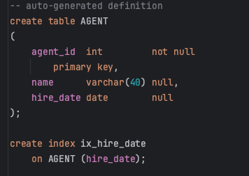
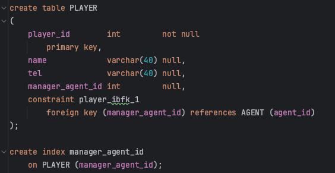
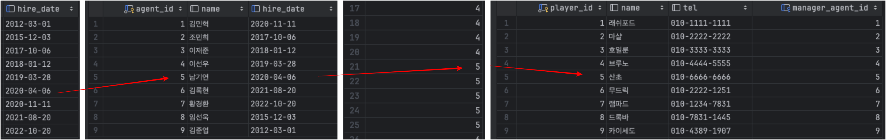
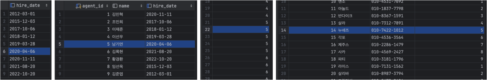
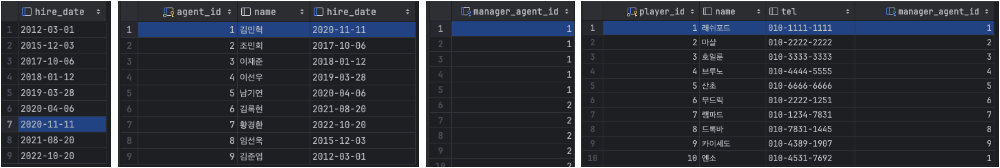
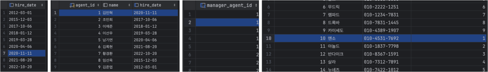

# NL조인

```
NL조인은 인덱스를 이용한 조인이다.
```

## 1. 동작원리

AGENT 테이블과 PLAYER 테이블에서 2020년 1월 1일 이후 입사한 에이전트가 관리하는 선수 데이터를 추출하려면 <br>
```sql
SELECT
    A.name, P.name, P.tel
FROM
    AGENT A, PLAYER P
WHERE
    A.hire_date >= '2020-01-01'
    AND A.agent_id = P.manager_agent_id;
```
AGENT 테이블에서 입사일이 2020-01-01 이후 입사한 직원을 찾아서 '건건이' 선수 테이블에서 'A.agent_id = P.manager_agent_id;' 가 일치하는 레코드를 찾는 것 <br>
이것이 바로 **Nested Loop** 조인이 사용하는 알고리즘이다.

일반적으로 NL 조인은 Outer와 Inner 양쪽 테이블 모두 인덱스를 이용한다.<br>
Outer 쪽 테이블은 사이즈가 크지 않으면 인덱스를 이용하지 않을 수 있다. 

```
왜? Outer 쪽 테이블은 사이즈가 크지 않으면 인덱스를 이용하지 않아도 되는걸까?
-> Outer 쪽 조회는 한번에 그치기 때문이다. Inner쪽은 Outer쪽에서 읽은 건수 만큼 loop를 탄다
 ```

---

### 테이블 기본 정보



---

### NL조인 과정

1. 입사일자 >= '2020-01-01'인 첫 번째 레코드를 찾는다.
2. ix_hire_date 인덱스에서 읽는 ROWID로 AGENT 테이블 레코드를 찾아간다 ( 남기연 )
3. 에이전트 번호 '5'으로 manager_agent_id 인덱스를 탐색한다.
4. manager_agent_id 인덱스에서 읽은 ROWID로 PLAYER 테이블 레코드를 찾아간다. ( 산초 )
---

1. manager_agent_id 인덱스에서 한 건 더 스캔하고 에이전트 번호가 '5'인 것을 확인
2. manager_agent_id 인덱스에서 읽은 ROWID로 PLAYER 테이블 레코드를 찾아간다.
3. 그렇게 '5'가 나올때 까지 스캔하고 더 큰 값이 나오면 인덱스 스캔을 멈춘다.
---

1. ix_hire_date 인덱스에서 한 건 더 스캔해서 입사일자가 '2020-11-11'인 레코드를 읽는다.
2. 인덱스에서 읽은 ROWID로 AGENT 테이블 레코드를 찾아간다. ( 김민혁 )
3. AGNET 테이블에서 읽은 에이전트 번호 '1'로 manager_agent_id 인덱스를 탐색한다.
4. manager_agent_id 인덱스에서 읽은 ROWID로 PLAYER 테이블 레코드를 찾아간다. ( 래쉬포드 )
---

1. manager_agent_id 인덱스에서 한 건 더 스캔하고 에이전트 번호가 '1'임을 확인한다.
2. manager_agent_id 인덱스에서 읽은 ROWID로 PLAYER 테이블 레코드를 찾아간다. ( 엔소) )
3. 그렇게 '1'이 나올때 까지 스캔하고 더 큰 값이 나오면 인덱스 스캔을 멈춘다.
---

## 2. NL 조인 실행계획 제어
NL 조인을 제어할 때는 use_nl 힌트를 사용한다.
ordered 힌트는 FROM 절에 기술한 순서대로 조인하라고 옵티마이저에 지시할 때 사용한다. use_nl 힌트는 NL 방식으로 조인하라고 지시할 때 사용한다. <br>
```sql
SELECT /*+ ordered use_nl(B) use_nl(C) use_hash(D) */ *
FROM A, B, C, D
WHERE ....
```
해석하면 A -> B -> C -> D 순으로 조인하되, B와 조인할 때 그리고 이어서 C와 조인할 때는 NL 방식으로 조인하고, D와 조인할 때는 해시 방식으로 조인하라는 뜻이다.<br>
```sql
SELECT /*+ leading(C,A,D,B) use_nl(A) use_nl(D) use_hash(B) */ *
FROM A, B, C, D
WHERE ....
```
ordered 대신 leading 힌트를 사용하여 FROM 절을 바꾸지 않고도 마음껏 순서를 제어할 수 있다.
```sql
SELECT /*+ use_cl(A,B,C,D) */ *
FROM A, B, C, D
WHERE ....
```
아무 힌트도 기술하지 않았다. 네 개 테이블을 NL 방식으로 조인하되 순서는 옵티마이저가 스스로 정하도록 제어할 수 있다.


## 3. NL 조인 수행 과정 분석
조건을 추가하여 NL 조인 수행 과정을 분석하자<br>
##### 인덱스 구성
 * AGENT_PK : 에이전트 번호
 * ix_hire_date : 입사일자
 * PLAYER_PK : 선수 번호
 * manager_agent_id : 관리 에이전트 번호
 * ix_value : 선수 가치
```sql
SELECT /* orderd use_nl(p) index(a) index(p) */
a.agent_id, a.name, a.hire_date, p.player_id, p.name, p.tel, p.value
FROM AGENT a, PLAYER p
WHERE p.manager_agent_id = a.agent_id -- 1
AND a.hire_date >= '2020-01-01' -- 2
AND a.dept_code = 'A1' -- 3
AND p.value >= 1000  -- 4
```
두 테이블에 index 힌트를 명시했으므로 둘 다 인덱스를 이용해서 엑세스한다.<br>
인덱스 명을 명시하지 않았으므로 어떤 인덱스를 이용할지는 옵티마이저가 선택한다.

1. 조건절 번호 **(2)** : 입사일자 >= '2020-01-01' 조건을 만족하는 레코드를 찾으려고 ix_hire_date 인덱스를 Range 스캔한다.
2. 조건절 번호 **(3)** : ix_hire_date 인덱스에서 읽은 ROWID로 AGENT 테이블을 엑세스해서 부서코드='A1' 필터 조건을 만족하는지 확인한다.
3. 조건절 번호 **(1)** : AGENT 테이블에서 읽은 에이전트 번호 값으로 조인 조건(p.manager_agent_id = a.agent_id)을 만족하는 선수 쪽 레코드를 찾으려고 manager_agent_id 인덱스를 Range 스캔한다.
4. 조건절 번호 **(4)** : manager_agent_id 인덱스에서 읽은 ROWID로 고객 테이블을 엑세스해서 가치(value) >= 1000 필터 조건을 만족하는지 확인한다.

```
입사일자를 인덱스 스캔으로 레코드를 찾고, 해당 에이전트의 부서를 필터해서 조건에 맞으면
해당 에이전트 번호를 선수테이블의 인덱스(에이전트번호)를 통해서 스캔으로 레코드를 찾고, 
해당 선수의 가치를 필터하고 조건검사 후 에이전트번호가 더 커지면 입사일자 레코드쪽 진행 반복이다.
```

## 4. NL 조인 튜닝 포인트
**첫 번째 튜닝 포인트**<br>
ix_hire_date 인덱스를 읽고 나서 AGENT 테이블 엑세스 하는 부분<br>
만약에 AGENT 테이블로 아주 많은 양의 랜덤 엑세스가 발생했고, 테이블에 부서코드 = 'A1' 조건에 의해 필터링되는 비율이 높다면  ix_hire_date 인덱스에 부서코드(dept_code) 컬럼을 추가하는 방안을 고려

**두 번째 튜닝 포인트**<br>
manager_agent_id 인덱스를 탐색하는 부분<br>
해당 인덱스를 탐색하는 횟수, 즉 조인 엑세스 횟수가 많을수록 성능이 느려진다. Outer 테이블인 AGENT를 읽고 필터링 한 결과 건수에 의해 결정된다.

**세 번째 튜닝 포인트**<br>
manager_agent_id 인덱스를 읽고 나서 PLAYER 테이블에 엑세스하는 부분<br>
여기서도 선수가치(value)>1000 조건에 의해 필터링되는 비율이 높다면 manager_agent_id 인덱스에 가치(value) 컬럼을 추가하는 방안 고려

**네 번째 튜닝 포인트**<br>
맨 처음 엑세스하는 ix_hire_date 인덱스에서 얻은 결과 건수에 의해 전체 일량이 좌우된다.<br>
Outer 테이블에서 추출된 레코드가 많으면 AGENT 테이블로 랜덤 엑세스하는 횟수, manager_agent_id 인덱스를 탐색하는 횟수, PLAYER 테이블로 랜덤 엑세스하는 횟수가 전반적으로 많아진다.

### 올바른 조인 메소드 선택
1. NL 조인부터 고려하는 것이 올바른 순서
2. 랜덤 엑세스가 발생하는 지점을 우선 파악
3. 조인 순서를 변경해서 랜덤 엑세스 발생량을 줄일 수 있는지, 뎌 효과적인 다른 인덱스가 있는지 등 검토
4. 필요하다면 인덱스 추가 또는 구성 변경을 고려
5. 이러한 방안들에도 좋은 성능을 내기 어렵다면 소트 머지 조인이나 해시 조인을 검토

## 5. NL 조인 특징 요약
### 1. 랜덤 엑세스 위주
```
레코드 하나를 읽으려고 블록을 통째로 읽는 랜덤 엑세스 방식은 어느정도 비효율이 존재한다.
인덱스 구성을 아무리 잘해도 대량의 데이터를 조인할 때 NL 조인이 불리한 이유
```
### 2. 한 레코드씩 순차적으로 진행
```
이 특징으로 부분범위 처리가 가능한 상황에서는
아무리 큰 테이블을 조인하더라도 매우 빠른 응답 속도를 낼 수 있다.
순차적으로 진행하므로 먼저 엑세스되는 테이블 처리 범위에 의해 전체 일량이 결정되는 특징도 나타난다.
```
### 3. 다른 조인 방식과 비교할 때 인덱스 구성 전략이 특히 중요
```
조인 컬럼에 대한 인덱스가 있느냐 없느냐, 있다면 컬럼이 어떻게 구성됐느냐에 따라 조인 효율이 크게 달라진다.
```