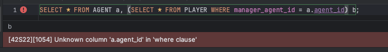
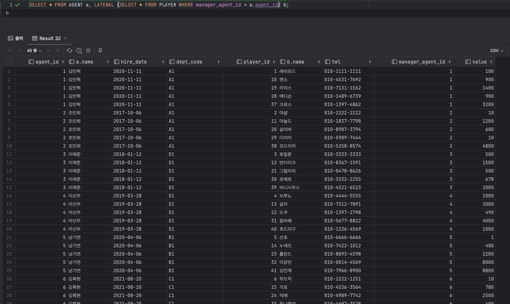

# 서브쿼리 조인

## 서브쿼리 변환이 필요한 이유
최근 옵티마이저는 비용을 평가하고 실헁계획을 생성하기에 앞서 사용자로부터 전달받은 SQL을 최적화에 유리한 형태로 변화하는 작업 즉, **쿼리 변환**부터 진행한다.

```우리가 애초에 최적화에 유리한 형태로 SQL을 짠다면 옵티마이저가 고생할 일이 없다.```

쿼리 변환은 간단하게 우리가 요청한 쿼리와 같은 값을 나오게 하면서 더 나은 성능이 기대되는 형태로 재작성한다.<br>
서브쿼리는 **하나의 SQL문 안에 괄호로 묶은 별도의 쿼리 블룩**<br>


### MySQL 서브쿼리 종류
1. 인라인 뷰(Inline View) : FROME 절에 사용한 서브쿼리
2. 중첩된 서브쿼리(Nested Subquery) : 결과집합을 한정하기 위해 WHERE절에 사용한 서브쿼리, 서브쿼리가 메인쿼리 컬럼을 참조하는 형태를 '상관관계 있는 서브쿼리'
3. 스칼라 서브쿼리(Scalar Subquery) : 한 레코드당 정확히 하나의 값을 반환하는 서브쿼리

옵티마이저는 쿼리 블록 단위로 최적화를 수행한다.<br>
아래 쿼리를 변환하지 않고 그대로 수행하면, 메인 쿼리(쿼리 블록1)과 EXISTS 서브쿼리(쿼리 블록2)를 각각 최적화한다.
```sql
-- 원본 쿼리
SELECT a.agent_id, a.name
FROM AGENT a
WHERE a.hire_date >= '2020-01-01'
AND exists (
    SELECT 'x'
    FROM PLAYER p
    WHERE p.manager_agent_id = a.agent_id
    AND p.value > 500
);

-- 쿼리 블록 1
SELECT a.agent_id, a.name
FROM AGENT a
WHERE a.hire_date >= '2020-01-01'

-- 쿼리 블록 2
SELECT 'x'
FROM PLAYER p
WHERE p.manager_agent_id = a.agent_id
AND p.value > 500
```

아래 쿼리도 변환하지 않고 그대로 수행하면, 메인 쿼리(쿼리 블록1)와 인라인 뷰(쿼리 블록2)를 각각 최적화한다.
```sql
-- 원본 쿼리
SELECT a.agent_id, a.name, b.`선수들의 평균가치`, b.`선수 중 최소가치`, b.`선수 중 최대가치`
FROM AGENT a,
     (
         SELECT p.manager_agent_id, avg(p.value) '선수들의 평균가치',
                 min(p.value) '선수 중 최소가치', max(p.value) '선수 중 최대가치'
         FROM PLAYER p
         WHERE p.value > 50
         GROUP BY manager_agent_id
     ) b
WHERE a.hire_date >= '2018-01-01'
AND b.manager_agent_id = a.agent_id;

-- 쿼리 블록 1
SELECT a.agent_id, a.name, b.`선수들의 평균가치`, b.`선수 중 최소가치`, b.`선수 중 최대가치`
FROM AGENT a, SYS_VW_TEMP b
WHERE a.hire_date >= '2018-01-01'
AND b.manager_agent_id = a.agent_id;

-- 쿼리 블록 2
SELECT p.manager_agent_id, avg(p.value) '선수들의 평균가치',
        min(p.value) '선수 중 최소가치', max(p.value) '선수 중 최대가치'
FROM PLAYER p
WHERE p.value > 50
GROUP BY manager_agent_id
```

```
하지만 이렇게 각각의 쿼리가 최적화되는게 전체적으로 최적화된것은 아니다.
전체를 보고, 쿼리를 최적화 해야한다.
```

## 서브쿼리와 조인
메인쿼리와 서브쿼리 간에는 부모와 자식이라는 종속적이고 계층적인 관계가 존재한다.<br>
서브쿼리는 메인쿼리에 종속되므로 단독으로 실행할 수 없다. 메인쿼리 건수만큼 값을 받아 반복적으로 필터링하는 방식으로 실행해야 한다.

### 필터 오퍼레이션
기본적으로 NL 조인과 처리 루틴이 같다. 차이가 있다면,

1. 필터는 메인쿼리의 한 로우가 서브쿼리의 한 로우와 조인에 성공하는 순간 진행을 멈추고, 메인 쿼리의 다음 로우를 계속 처리한다는 점이다. 아래 for문 처럼 처리되어야 메인쿼리 결과집합이 서브쿼리 집합 수준으로 확장되는 현상 (에이전트 번호 중복)을 막을 수 있다.
    ```sql
    SELECT a.agent_id, a.name
    FROM AGENT a
    WHERE a.hire_date >= '2020-01-01'
    AND exists (
        SELECT 'x'
        FROM PLAYER p
        WHERE p.manager_agent_id = a.agent_id
        AND p.value > 500
    );
    ```
    ```java
    for ( /*SELECT a.agent_id, a.name FROM AGENT a WHERE ... */ ) {
        for( /* SELECT 'x' FROM PLAYER p WHERE p.manager_agent_id = a.agent_id AND ... */ ) {
            // 조인에 성공하면
            break;
        }
    }
    ```
2. 필터는 캐싱기능을 갖는다는 점이다. 필터를 처리한 결과를 서브쿼리 입력에 값에 따른 반환 값(true 또는 false)를 캐싱하는 기능이다. 이 기능이 작동하므로 서브쿼리를 수행하기 전에 항상 캐시부터 확인한다.
    ```
    캐싱은 쿼리 단위로 이뤄지고, 쿼리를 시작할 때 PGA 메모리 공간에 할당하고, 쿼리를 수행하면서 공간을 채워나가며, 쿼리를 마치는 순간 공간을 반환한다. 

    그렇다는건, 서브쿼리의 캐시는 독립적인 메모리 공간이라면 와그 시스템 상에서 서브쿼리에 캐시은 크게 활용이 안되는건 아닐까 생각합니다.
    ```

3. 필터 서브쿼리는 일반 NL 조인과 달리 메인쿼리에 종속되므로 조인 순서가 고정된다. 항상 메인쿼리가 드라이빙 집합이다.

### 서브쿼리 Unnesting
보통 그냥 두어도 옵티마이저가 Unnesting을 선택한다.<br>
서브쿼리 Unnesting은 메인과 서브쿼리 간의 계층구조를 풀어 서로 같은 레벨로 만들어 준다는 의미에서 '서브쿼리 Flattening'이라고 부르기도 한다. <br>

옵티마이저가 Unnesting하는 이유는 무엇일까?
```
Unnesting된 서브쿼리는 다양한 방식으로 실행될 수 있다.
필터방식은 항상 메인쿼리가 드라이빙 집합이지만, Unnesting된 서브쿼리는 메인 쿼리 집합보다 먼저 처리될 수 있다.
아래 서브쿼리가 드라이빙되도록 leading 힌트를 사용했다.
```
```sql
SELECT /*+ leading(p@subq) use_nl(c) */a.agent_id, a.name
FROM AGENT a
WHERE a.hire_date >= '2020-01-01'
AND exists (
    SELECT /*+ qb_name(subq) unnest */'x'
    FROM PLAYER p
    WHERE p.manager_agent_id = a.agent_id
    AND p.value > 500
);
```

```
결과적으로, 서브쿼리를 Unnesting 해서 메인쿼리와 같은 레벨로 만들면, 다양한 조인 메소드(NL, 해시)를 선택할 수 있고,
조인 순서도 마음껏 정할 수 있다. 결국 더 좋은 실행경로를 찾을 가능성이 높아지는 것.

주의할 점이 있는데, rownum을 사용하면 옵티마이저가 Unnesting하지 못하게 막아버린다!!!!
```

### 서브쿼리 Pushing
Unnesting 되지 않은 서브쿼리는 항상 필터 오퍼레이션 방식으로 처리된다. 대게 실행계획에 마지막에 처리가 된다.
```sql
select /*+ leading(p) use_nl(t) */ count(distinct p.상품번호), sum(t.주문금액)
from 상품 p, 주문 t
where p.상품번호 = t.상품번호
and p.등록일시 >= trunc(add_months(sysdate, -3) 'mm')
and t.주문일시 >= trunc(sysdate - 7)
and exists ( select 'x' from 상품분류
             where 상품분류코드 = p.상품분류코드
             and 상위분류코드 = 'AK')
```
해당 쿼리가 조인과정에서 많은 I/O가 발생한다면, 서브쿼리 필터링을 먼저 처리함으로써 조인 단계로 넘어가는 로우 수를 크게 줄일 수 있다면 그만큼 성능 향상이 된다. 그때 사용하는 힌트는 **NO_UNNEST PUSH_SUBQ** 이다.<br>
Pushing 서브쿼리는 <U>서브쿼리 필터링을 가능한 한 앞 단계에서 처리하도로고 강제하는 기능이며,</U> push_subq/no_push_subq 힌트로 제어한다. <U>이 기능은 Unnesting 되지 않는 서브쿼리에만 작동</U>한다. 그래서 push_subq 힌트를 사용하고 싶다면 un_unnest 힌트도 꼭 써야 한다.

## 뷰(View)와 조인
최적화 단위가 쿼리 블록이므로 옵티마이저가 뷰(View) 쿼리를 변환하지 않으면 뷰 쿼리 블록을 독립적으로 최적화한다.
```sql
SELECT c.고객번호, c.고객명, t.평균거래, t.최소거래, t.최대거래
FROM 고객 c
     ,(
        SELECT 고객번호, avg(거래금액) 평균거래, min(거래금액) 최소거래, max(거래금액) 최대금액
        FROM 거래
        WHERE 거래일시 >= trunc(sysdate, 'mm') -- 당월 발생한 거래
        GROUP BY 고객번호
     ) t
WHERE c.가입일시 >= trunc(add_months(sysdate, -1) 'mm') -- 전월 이후 가입 고객
AND t.고객번호 = c.고객번호
```
위의 쿼리를 보면, 뷰를 독립적으로 최적화하면 당월 거래 전체를 읽어 고객번호 수준으로 GROUP BY하는 실행계획을 수립할 것이다. 그리고 고객 테이블과 조인을 처리할 것이다.

문제는, 고객 테이블에서 '전월 이후 가입한 고객'을 필터링하는 조건이 인라인 뷰 바깥에 있다는 사실이다. 이 조건이 있어도, 인라인 뷰에선 당월에 거래한 '모든' 고객의 거래 데이터를 읽어야 한다.

---

```sql
SELECT c.고객번호, c.고객명, t.평균거래, t.최소거래, t.최대거래
FROM 고객 c
     ,(
        SELECT /*+ merge */고객번호, avg(거래금액) 평균거래, min(거래금액) 최소거래, max(거래금액) 최대금액
        FROM 거래
        WHERE 거래일시 >= trunc(sysdate, 'mm') -- 당월 발생한 거래
        GROUP BY 고객번호
     ) t
WHERE c.가입일시 >= trunc(add_months(sysdate, -1) 'mm') -- 전월 이후 가입 고객
AND t.고객번호 = c.고객번호
```
merge 힌트를 이용해 뷰를 메인 쿼리와 머징(Merging) 하도록 처리
```sql
SELECT c.고객번호, c.고객명, avg(t.거래금액) 평균거래, min(t.거래금액) 최소거래, max(t.거래금액) 최대금액
FROM 고객 c, 거래 t
WHERE c.가입일시 >= trunc(add_months(sysdate, -1) 'mm')
AND t.고객번호 = c.고객번호
AND t.거래일시 >= trunc(sysdate, 'mm')
GROUP BY c.고객번호, c.고객명

-- 고객 테이블엔 가입일시에 대한 인덱스가 있고, 거래 테이블엔 [고객번호 + 거래일시] 순으로 인덱스가 있다.
```
가장 먼저 고객 테이블에 가입일시로 전월 이후에 가입한 고객만 인덱스 Range Scan으로 읽는다. <br>
거래 테이블과 조인할 때는 해당 고객들에 대한 당월 거래만 읽는다.

단점은 조인에 성공한 전체 집합을 GROUP BY 하고서야 데이터를 출력할 수 있다는데 있다. 즉 부분범위 처리가 불가능하다.
양 테이블에 모든 데이터를 다 읽어햐 한다는거 -> 즉 양 테이블 모두 데이터가 많은 집합이라면 성능이 느려질 것이다.

### 조인 조건 Pushdown
오라클 11g 이후로 '조인 조건 Pushdown'이라는 쿼리 변환 기능이 작동하는데, 메인 쿼리를 실행하면서 조인 조건절 값을 건건이 뷰 안으로 밀어 넣는 기능이다. 이 방식을 사용하면 위에 쿼리에서 전월 이후 가입한 고객을 대상으로 '건건이' 당월 거래 데이터만 읽어서 조인하고 GROUP BY를 수행한다.
```
MySQL 8.0.22 버전 이상 부터는 적합한 서브 쿼리에 대한 Derived Condition Pushdown 기능을 지원
```

오라클 12c, MySQL 8.0 이상에서는 인라인 뷰를 아래와 같이 Lateral로 선언하면, 인라인 뷰 안에서 메인쿼리 테이블의 컬럼을 참조할 수 있다. 하지만, 기본적으로 사용할 이유가 많이 없다. 옵티마이저를 오히려 방해하는 것 일수도....




## 스칼라 서브쿼리 조인
