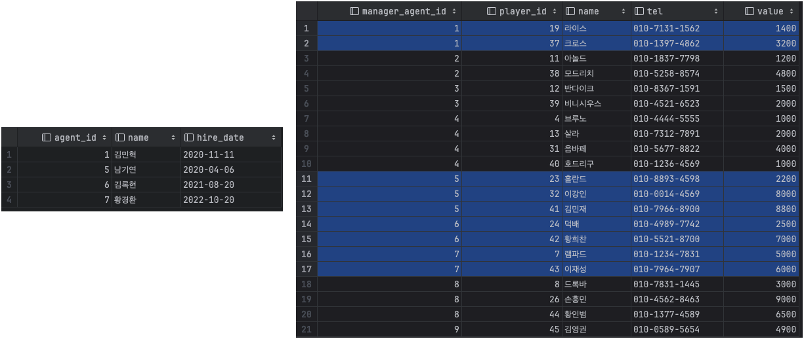

# 소트 머지 조인
```
조인 컬럼에 인덱스가 없을 때, 대량 데이터 조인이어서 인덱스가 효과적이지 않을 때
옵티마이저는 NL조인 대신에 소트 머지 조인이나, 해시 조인을 선택한다. 
```

## SGA vs PGA
공유 메모리 영역인 SGA에 캐시된 데이터는 여러 프로세스가 공유할 수 있다. <br>
여러 프로세스가 공유는 할 수 있지만 동시에 엑세스할 수 없다. Lock 매커니즘으로 프로세스간의 엑세스 직렬화를 동작한다. <br>
오라클 서버 프로세스는 SGA에 공유된 데이터를 읽고 쓰면서, 동시에 자신만의 고유 메모리 영역을 갖는다 -> **PGA** <br>
PGA는 프로세스에 종속적인 고유 데이터를 저장하는 용도로 사용

```
PGA는 독립적인 메모리 공간으로 래치 매커니즘(동시작업으로부터 자원을 보호하는 것)이 불필요
따라서, 같은 양의 데이터를 읽더라도 SGA보다 PGA가 빠르다고 생각하면 된다.
```

## 소트 머지 조인의 기본 메커니즘
소트 머지 조인은 두 단계로 진행된다. <br>
1. 소트 단계 : 양쪽 집합을 조인 컬럼 기준으로 정렬한다.
2. 머지 단계 : 정렬한 양쪽 집합을 서로 머지한다.

```sql
SELECT /*+ ordered use_merge(p) */
    a.agent_id, a.name, a.hire_date,
    p.player_id, p.name, p.tel, p.value
FROM
    agent a, player p
WHERE
    p.manager_agent_id = a.agent_id
    AND a.hire_date >= '20200101'
    AND a.dept_code = 'A1'
    AND p.value >= 1000;
```

위 SQL 수행 과정을 풀어보면
1. 아래 조건에 해당하는 에이전트 데이터를 읽어 조인컬럼인 에이전트 번호 순으로 정렬한다.
   ```sql
   SELECT agent_id, name, hire_date
   FROM agent
   WHERE hire_date >= '20200101'
   AND dept_code = 'A1'
   ORDER BY agent_id
   ```
2. 정렬한 결과 집합은 PGA 영역에 할당된 Sort Area에 저장한다.(PGA에 못 담으면 Temp 테이블스페이스 저장)
3. 아래 조건에 해당하는 선수 데이터를 읽어 조인컬럼인 에이전트 번호 순으로 정렬한다. 
    ```sql
   SELECT player_id, name, tel, value, manager_agent_id
   FROM player
   WHERE value >= 1000
   ORDER BY manager_agent_id
   ```
4. 정렬한 결과 집합은 PGA 영역에 할당된 Sort Area에 저장한다.(PGA에 못 담으면 Temp 테이블스페이스 저장)
5. PGA(또는 Temp 테이블스페이스)에 저장한 에이전트 데이터를 스캔하면서 PGA에 저장한 선수 데이터와 조인한다.

-> 1,2,3,4의 단계가 소트 단계이고, 5가 머지 단계이다. 머지 단계는 NL조인과 다르지 않다.


```
Sort Area에 저장한 데이터 자체가 인덱스 역할을 하므로 소트 머지 조인은 조인 컬럼에 인덱스가 없어도
사용할 수 있는 조인 방식이다.
```

## 소트 머지 조인이 빠른 이유
NL 조인의 치명적인 단점은 대량 데이터 조인할 때 성능이 매우 느리다는데 있다. <br>
소트 머지 조인은 Sort Area에 미리 정렬해 둔 자료구조를 이용한다는 점만 다를 뿐 조인 프로세싱 자체는 NL 조인과 같다.<br>
### NL 조인과 소트 머지 조인은 그럼 어디에서 성능 차이가 날까?
```
NL 조인은 '인덱스를 이용한 조인 방식', 조인 과정에서 엑세스하는 모든 블록을 랜덤 엑세스 방식으로 '건건이' DB 버퍼캐시를 경유해서 읽는다.
즉, 인덱스든 테이블이든, 읽는 모든 블록에 래치 획득 및 캐시버퍼 체인 스캔 과정을 거친다.
```
```
반면 소트 머지 조인은 양쪽 테이블로부터 조인 대상 집합을 '일괄적으로' 읽어 PGA(또는 Temp 테이블스페이스)에 저장한 후에 조인한다.
PGA는 프로세스만을 위한 독립적인 메모리 공간이므로 데이터를 읽을 때 래치 획득 과정이 없다. 그래서 성능 차이가 난다.
하지만 소트 머지 조인도 양쪽 테이블로부터 조인 대상을 집합을 읽을 때는 DB 버퍼캐시를 경유한다.
```

## 소트 머지 조인의 주용도
해시 조인의 등장으로 소트 머지 조인은 거의 사용하지 않게 되었다.<br>
하지만 해시 조인은 조인 조건식이 등치(=) 조건이 아닐 때 사용할 수 없다는 단점이 있다.
```
1. 조인 조건식이 등치(=) 조건이 아닌 대량 데이터 조인
2. 조인 조건식이 아예 없는 조인
```

## 소트 머지 조인 요약
1. 소트 머지 조인은 조인을 위해 실시간으로 인덱스를 생성하는 것과 다름없다.
2. 양쪽 집합을 정렬한 다음에 NL 조인과 같은 방식으로 진행 -> PGA 영역에 저장한 데이터를 이용하기 때문에 빠르다.
3. 조인 컬럼에 인덱스가 없는 상황에서 두 테이블을 각각 읽어 조인 대상 집합을 줄일 수 있을 때 유리하다.
4. 스캔 위주의 엑세스 방식을 사용한다는 점, 하지만 모든 처리가 스캔 위주는 아님


<br><br>

# 해시 조인
소트 머지 조인은 항상 양쪽 테이블을 정렬하는 부담이 있는데, 해시 조인은 그런 부담도 없다.

## 기본 메커니즘
해시 조인도 두 단계로 진행된다.
```
1. Build 단계 : 작은 쪽 테이블(Build Input)을 읽어 해시 테이블(해시 맵)을 생성한다.
2. Probe 단계 : 큰 쪽 테이블(Prode Input)을 읽어 해시 테이블을 탐색하면서 조인한다.
```

```sql
SELECT /*+ ordered use_hash(p) */
    a.agent_id, a.name, a.hire_date,
    p.player_id, p.name, p.tel, p.value
FROM
    agent a, player p
WHERE
    p.manager_agent_id = a.agent_id
    AND a.hire_date >= '20200101'
    AND a.dept_code = 'A1'
    AND p.value >= 1000;
```
1. Build 단계 : 아래 조건에 해당하는 에이전트 데이터를 읽어 해시 테이블을 생성한다. 이때, 조인컬럼인 에이전트 번호를 해시 테이블 키 값으로 사용한다. 에이전트 번호를 해시 함수에 입력해서 반환된 값으로 체인을 찾고, 그 해시 체인데 데이터를 연결한다. 해시 테이블은 PGA 영역에 할당된 Hash Area에 저장한다. 
    ```sql
    SELECT agent_id, name, hire_date
    FROM agent
    WHERE hire_date >= '20200101'
    AND dept_code = 'A1'
    ```
2. Probe 단계 : 아래 조건에 해당하는 선수 데이터를 하나씩 읽어 앞서 생성한 해시 테이블을 탐색한다. 즉, 에이전트 번호를 해시 함수에 입력해서 반환된 값으로 해시 체인을 찾고, 그 해시 체인을 스캔해서 값이 같은 에이전트 번호를 찾는다.
    ```sql
   SELECT player_id, name, tel, value, manager_agent_id
   FROM player
   WHERE value >= 1000
   ORDER BY manager_agent_id
   ```

Build 단계에서 사용한 해시 함수를 Probe 단계에서도 사용하므로 같은 에이전트 번호를 입력하면 같은 해시 값을 반환, <br>
따라서, 해시 함수가 반환한 값에 해당하는 해시 체인만 스캔하면 된다.

## 해시 조인이 빠른 이유
해시 테이블을 PGA 영역에 할당하기 때문이다. 소트 머지 조인과 같은 이유.

> 해시 테이블에 담기는 정보 <br>
> 해시 테이블에는 조인 키값뿐만 아니라 SQL에 사용한 컬럼을 모두 저장한다. <br>
> 그렇지 않다면 해시 조인에 장점이 없는 것.

해시 조인과 소트 머지 조인, 둘 다 조인 오페레이션을 PGA에서 처리한다는 공통점을 갖는다. <br>
그런데 대량 데이터를 조인할 때, 왜 해시 조인이 더 빠른것인가?<br>
> 사전 작업에 있다. 소트 머지 조인에서 사전 준비작업은 '양쪽' 집합을 모두 정렬해서 PGA 담는 작업이고, 두 집합 중 어느 하나가 중대형 이상이면, Temp 테이블스페이스에 즉, 디스크에 쓰는 작업을 반드시 수반됨. <br>
> 
> 해시 조인에서는 사전 준비작업은 양쪽 집합 중 어느 '한쪽'을 읽어 해시 맵을 만드는 작업이다. 둘 중 작은 집합을 해시 맵으로 선택하므로 두 집합이 다 PGA에 담을 정도가 아닌 이상 디스크에 쓰는 작업이 없다.

해시 조인은 NL 조인처럼 조인 과정에서 발생하는 랜덤 엑세스 부하가 없고, 소트 머지 조인처럼 양쪽 집합을 미리 정렬하는 부하도 없다. 설령 Hash Area 크기를 초과한다고 해도 일반적으로 해시 조인이 가장 빠르다.

## 대용량 Build Input 처리
두 테이블 모두 대용량 테이블이어서 인메모리 해시 조인이 불가능한 상황이라면....?

> 두 단계로 나눠서 진행하는데 바로 **분할/정복** 방식이다.<br>
> 1. 파티션 단계 : 조인하는 양쪽 집합의 조인 컬럼에 해시 함수를 적용하고, 반환된 해시 값에 따라 동적으로 파티셔닝한다. 독립적으로 처리할 수 있는 여러 개의 작은 서브 집합으로 분할함. 디스크 공간에 저장해야함.
> 2. 조인 단계 : 분할된 서브 집합에 대해 하나씩 조인을 수행한다. 이때 각각에 대한 Build와 Probe을 독립적으로 진행한다. 각 파티션 짝별로 작은 쪽을 Build Input으로 선택하고 해시 테이블 생성.


## 해시 조인 실행계획 제어
### 세 개 이상 테이블 해시 조인
```sql
SELECT *
FROM A, B, C
WHERE A.key = B.key
AND B.key = C.key
-- A와 B를 조인하고, B와 C를 조인한다.
```

```sql
SELECT *
FROM A, B, C
WHERE A.key = B.key
AND A.key = C.key
-- A와 B를 조인하고, A와 C를 조인한다.
```

```sql
SELECT /*+ leading(T1, T2, T3) use_hash(T2) use_hash(T3) */*
FROM T1, T2, T3
WHERE T1.key = T2.key
AND T2.key = T3.key
-- 세 테이블에 대한 해시 조인을 제어할 때, leading 힌트를 사용하면 된다. A,B,C든 결국 leading에 넣는 순서니깐
```

#### leading 힌트 첫 번째 파라미터로 지정한 테이블은 무조건 Build Input으로 선택된다.
> Build Input을 제어하고 싶다면 swap_join_inputs 힌트를 사용한다.
> Probe Input으로 제어하고 싶다면 no_swap_join_inputs 힌트를 사용한다. ( 오라클 10.1.0.3 버전 부터 제공 )


## 조인 메소드 선택 기준
```
1. 소량 데이터 조인할 때 -> NL 조인
2. 대량 데이터 조인할 때 -> 해시 조인
3. 대량 데이터 조인인데 해시 조인으로 처리할 수 없을 때, 즉 조인 조건식이 등치(=)조건이 아닐 때 -> 소트 머지 조인

여기서 데이터량의 많고 적음을 나타내는 건 -> 랜덤 엑세스의 수
```

### 수행빈도가 매우 높은 쿼리에 대한 기준
1. (최적화된) NL 조인과 해시 조인 성능이 같으면 NL 조인
2. 해시 조인이 약간 더 빨라도 NL 조인
3. NL 조인보다 해시 조인이 매우 빠른 경우, 해시 조인<br>

#### 옵티마이저는 수행빈도까지 고려하지 않는다. 
그럼 왜 NL 조인을 가장 먼조 고려하는가... <br>
NL 조인에 사용하는 인덱스는 영구적으로 유지하면서 다양한 쿼리를 위해 공유 및 재사용하는 자료구조<br>
해시 테이블은 단 하나의 쿼리를 위해 생성하고 조인이 끝나면 곧바로 소멸하는 자료구조<br>

같은 쿼리를 100개 프로세스가 동시에 수행하면, 해시 테이블도 100개가 만들어진다. 따라서 수행시간이 짧으면서 수행빈도가 매우 높은 쿼리를 해시 조인으로 처리하면 CPU와 메모리 사용률이 크게 증가한다.

---

#### 해시 조인이 사용될 최적의 조건
1. 수행 빈도가 낮고
2. 쿼리 수행 시간이 오래 걸리는
3. 대량 데이터를 조인할 때
