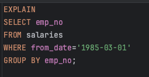
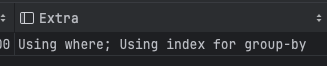
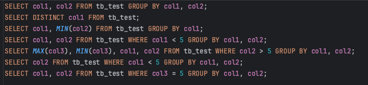
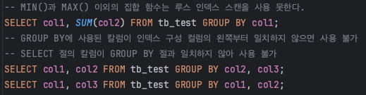
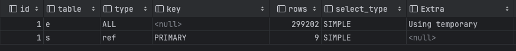
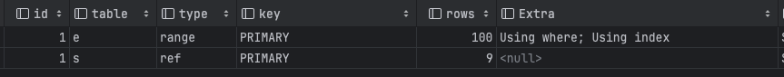

># 옵티마이저의 중복 제거 처리
<br>

## GROUP BY 처리
GROUP BY도 쿼리가 스트리밍된 처리를 할 수 없게 하는 처리 중 하나다.
HAVING 절은 GROUP BY 결과에 대해 필터링 역할이므로, 따로 인덱스나 다른 방법으로 튜닝이 없다.

### 인덱스 스캔을 이용하는 GROUP BY(타이트 인덱스 스캔)
ORDER BY의 경우와 마찬가지로 조인의 드라이빙 테블에 속한 칼럼만 그루핑할 때 인덱스를 활용한다.
GROUP BY가 인덱스를 통해 처리되는 쿼리는 이미 정렬된 인덱스를 읽는 것이므로 추가적인 작업이 없다.
실행계획을 통해 보면 Extra칼럼에 인덱스를 활용하면 **Using index for group-by**로 표시된다.

### 루스 인덱스 스캔을 이용하는 GROUP BY
```
루스 인덱스 스캔 : 인덱스의 레코드를 건너뛰면서 필요한 부분만 읽어서 가져오는 것
```
MySQL의 루스 인덱스 스캔 방식은 단일 테이블에 대해 수행되는 GROUP BY 처리에만 사용된다.<br>
루스 인덱스 스캔은 유니크한 값의 수가 적을수록 성능이 향상된다. <br>
루스 인덱스 스캔으로 처리되는 쿼리는 임시 테이블이 필요하지 않다.




### 해당 쿼리를 어떻게 실행했는지 순서

1. (emp_no, from_date) 인덱스를 차례대로 스캔하면서 emp_no의 첫 번째 유일한 값을 찾아낸다. <br>(emp_no:10001)
2. emp_no의 첫 번째 값 중에서 from_date가 1985-03-01인 레코드만 가져온다. 이 과정에서 <br>
   'emp_no=첫 번째 값 AND from_date='1985-03-01' 조건으로 인덱스를 검색하는 것과 흡사
3. (emp_no, from_date) 인덱스에서 emp_no의 두 번째 유일한 값을 가져온다.(emp_no:10002)
4. 해당 과정들을 반복하여 작업한다.

### 루스 인덱스 스캔을 사용할 수 있는 쿼리

```sql
   EXPLAIN SELECT MAX(col3), MIN(col3), col1, col2 FROM tb_test WHERE col2 > 2 GROUP BY col1, col2;
   EXPLAIN SELECT  col1, col2 FROM tb_test WHERE col2 > 2 GROUP BY col1, col2;
   -- (col1,col2)에 대한 인덱스를 만들고 테스트를 해봤는데 첫 번째 쿼리에선  Using index for group-by이 나오지 않음
   -- 첫 번째 쿼리의 실행계획에 Extra 칼럼은 Using Index Condition로 표시 
```
>**Using Index Condition** : 인덱스를 비교하는 작업은 InnoDB 스토리지 엔진이 수행하고, 조건을 비교하는 작업은 MySQL 엔진에서 수행하는데 인덱스를 범위 제한 조건으로 사용하지 못하는 조건은 스토리지 엔진으로 전달하지 않는다. 이러한 비효율을 없애기 위해서 **인덱스를 범위 제한 조건으로 사용하지 못하더라도 인덱스에 포함된 칼럼의 조건이 있다면 스토리지 엔진으로 전달해주는 최적화**

### 루스 인덱스 스캔을 사용할 수 없는 쿼리


### 임시 테이블을 사용하는 GROUP BY
GROUP BY의 기준 칼럼이 인덱스를 전혀 사용하지 못할 때 사용되는 방식.
```sql
EXPLAIN SELECT e.last_name, AVG(s.salary) FROM employees e, salaries s WHERE s.emp_no=e.emp_no GROUP BY e.last_name;
```


인덱스를 전혀 사용하지 못해서 "Using temporary" 메시지가 표시됐다.
"Using filesort"가 표시되지 않는건 MySQL 8.0 이전 버전까지는 GROUP BY가 사용된 쿼리는 그루핑되는 칼럼 기준으로 묵시적 정렬을 해줬지만, MySQL 8.0 버전부터는 묵시적인 정렬은 더 이상 실행되지 않는다. 하지만 ORDER BY를 명시하면 정렬 작업을 실행하므로 "Using filesort" 메시지가 표시된다.


MySQL 8.0 에서는 GROUP BY가 필요한 경우 내부적으로 GROUP BY 절의 칼럼들로 구성된 유니크 인덱스를 가진 임시 테이블을 만들어서 중복 제거와 집합 함수 연산을 수행한다. 

```sql
SELECT e.last_name, AVG(s.salary) FROM employees e, salaries s WHERE s.emp_no=e.emp_no GROUP BY e.last_name;
-- 해당 쿼리를 수행하기 위해서 임시 테이블을 생성하고, 조인의 결과를 한 건씩 가져와 임시 테이블에서 중복 체크 하면서 INSERT 또는 UPDATE를 실행한다.
CREATE TEMPORARY TABLE ... (
   last_name VARCHAR(16),
   salary INT,
   UNIQUE INDEX ux_lastname(last_name)
);
```

## DISTINCT 처리
### SELECT DISTINCT ...
단순히 SELECT되는 레코드 중에서 유니크한 레코드만 가져오고자 하면 SELECT DISTINCT 형태의 쿼리문을 사용한다.<br>
이 경우에는 GROUP BY와 동일한 방식으로 처리된다. 아래 두 쿼리는 내부적으로 같은 작업을 수행한다.
```sql
SELECT DISTINCT emp_no FROM salaries;
SELECT emp_no FROM salaries GROUP BY emp_no;
```
---

우리가 DISTINCT를 사용할 때 자주 실수하는 것이 SELECT하는 레코드들을 유니크하게 하는 것이지 특정 칼럼만 유니크하게 조회하는게 아니라는 것. 아래 쿼리에 괄호는 무의미하고 사실상 쿼리가 수행될 때 저 괄호는 없어진다고 보면 된다.
```sql
SELECT DISTINCT first_name, last_name FROM employees;
SELECT DISTINCT (first_name), last_name FROM employees;
```

### 집합 함수와 함께 사용된 DISTINCT
COUNT() 또는 MIN(), MAX() 같은 집합 함수 내에서 DISTINCT 키워드가 사용될 수 있다.<br>
이 경우네는 일반적으로 SELECT DISTINCT와 다른 형태로 해석된다. 집합 함수 내에세 사용된 DISTINCT는 그 집합 함수의 인자로 전달된 칼럼값이 유니크한 것들을 가져온다.

```sql
EXPLAIN SELECT COUNT(DISTINCT s.salary) FROM employees e, salaries s
WHERE e.emp_no=s.emp_no AND s.emp_no BETWEEN 100001 AND 100100;
```
COUNT(DISTINCT s.salary)를 처리하기 위해 임시 테이블을 사용한다. 하지만 실행 계획에는 "Using temporary"를 표시하지 않는다.


위 쿼리의 경우에는 employees 테이블과 salaries 테이블을 조인한 결과에서 salary 칼럼의 값만 저장하는 임시 테이블을 만들어서 사용한다. 이때 임시 테이블의 salary 칼럼에는 유니크 인덱스가 생성되기 때문에 레코드 건수가 많아진다면 상당히 느려질 수 있다.

> DISTINCT가 집합 함수 없이 사용되는 경우와 집합 함수 내에서 사용된 경우 쿼리의 결과가 달라진다. 
```sql
-- first_name과 last_name 두 개의 조합이 유니크한 집합  row 200개
SELECT DISTINCT first_name, last_name
FROM employees
WHERE emp_no BETWEEN 10001 AND 10200;

-- first_name의 유니크한 갯수와 last_name의 유니크한 갯수로 first_name : 188개, last_name : 184개
SELECT COUNT(DISTINCT first_name), COUNT(DISTINCT last_name)
FROM employees
WHERE emp_no BETWEEN 10001 AND 10200;

-- first_name과 last_name 두 개의 조합이 유니크한 집합의 갯수  200개
SELECT COUNT(DISTINCT first_name, last_name)
FROM employees
WHERE emp_no BETWEEN 10001 AND 10200;
```


 
